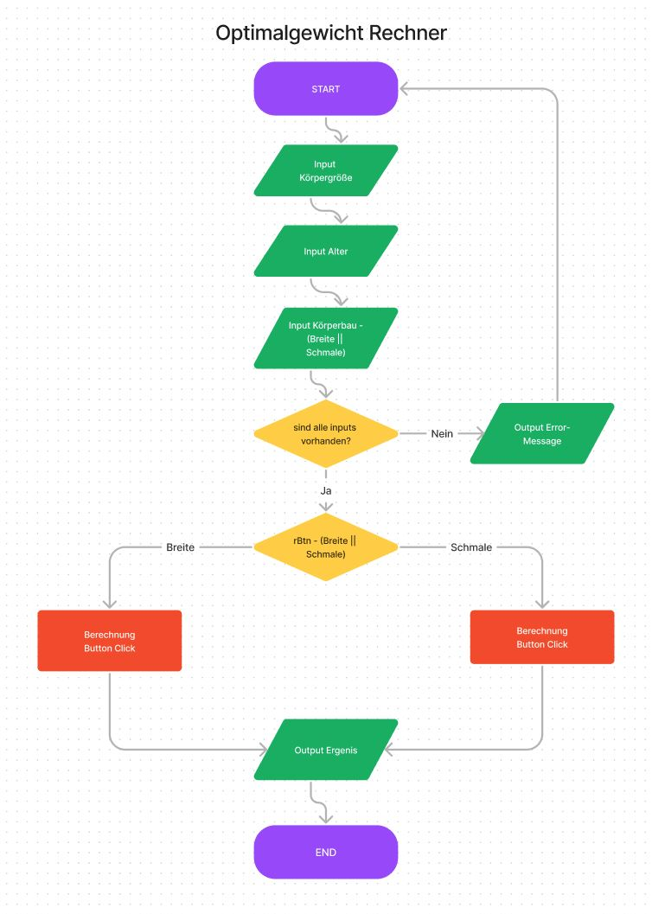
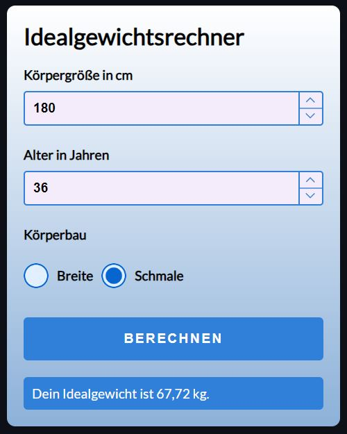

# Idealgewichts-Rechner – JavaScript-Projekt

## Beschreibung

Dieses JavaScript-Projekt wurde im Rahmen eines Coding-Bootcamps bei supercode.de erstellt. Es handelt sich um einen Idealgewichts-Rechner, der es ermöglicht, das Optimalgewicht, abhängig vom jeweiligen Körperbau des Users, zu berechen.

Die Anwendung bietet die Möglichkeit, die folgenden Berechnungen durchzuführen:

- Idealgewicht für einen breiten Körperbau
- Idealgewicht für einen zierlichen und schmalen Körperbau

Das Idealgewicht wird anhand folgender Formeln berechnet:
- Formel für Menschen mit einem zierlichen und schmalen Körperbau:
[(Körpergröße in cm - 100) + (Alter/ 10)] x 0,9 x 0,9

- Formel für Menschen mit einem eher breiten Körperbau:
[(Körpergröße in cm - 100) + (Alter/ 10)] x 0,9 x 1,1

## Funktionsweise

1. Gib deine Körpergröße in cm an.
2. Gib dein Alter in Jahren an.
3. Wähle aus, ob du einen breiten oder schmalen Körperbau hast.
6. Klicke auf den Berechnen-Button, um die Ergebnisse anzeigen zu lassen.

## Screenshots

## GitHub Repository

Du findest das gesamte Projekt auf GitHub: [GitHub Repository](https://w1tch3r-code.github.io/js_optimalgewicht_rechner/)

## Anmerkungen

- Dieses Projekt wurde im Rahmen eines Coding-Bootcamps bei supercode.de erstellt.
- Die Anwendung ermöglicht eine einfache und schnelle Berechnung des Idealgewichts abhängig vom jeweiligen Körperbau.
- Die README.md-Datei dient auch als Bewerbungsunterlage und präsentiert meine Fähigkeiten in der Webentwicklung.
